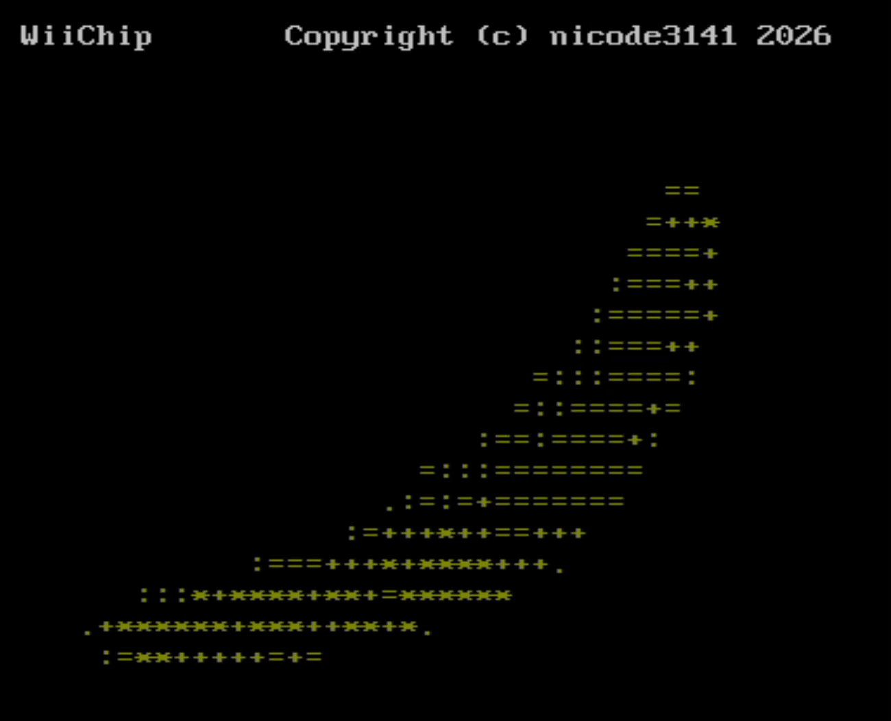

# C Chip

Displays any fromatted json stream as a ASCII video on the WII

### Creating own ascii video file

you can convert a regular gif to a readable json file using my Project [FunWithAscii](https://github.com/nicode3141/FunWithAscii).

### Despendencies

- cJSON
- Wii (devkitPro)
